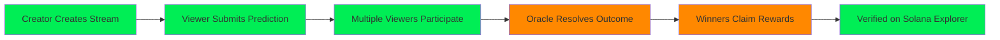

# 🗺️ Implementation Roadmap - Priority Matrix

**Last Updated:** October 14, 2025  
**Hackathon Submission:** October 23, 2025

---

## 📊 Feature Comparison: Submit vs Develop

### Current State Analysis

```
┌───────────────────────────────────────────────────────────────┐
│                    FEATURE IMPLEMENTATION STATUS               │
├───────────────────────────────────────────┬─────────┬─────────┤
│ Feature                                   │ Submit  │ Develop │
├───────────────────────────────────────────┼─────────┼─────────┤
│ 📝 Documentation & Architecture          │   ✅    │   ✅    │
│ 🔧 Smart Contract - Create Stream        │   ❌    │   ✅    │
│ 👥 Smart Contract - Join Stream          │   ❌    │   ✅    │
│ 🎯 Smart Contract - Submit Prediction    │   ❌    │   ⚠️    │
│ 🏆 Smart Contract - Resolve Prediction   │   ❌    │   ❌    │
│ 💰 Smart Contract - Claim Reward         │   ❌    │   ❌    │
│ 🧮 Reward Calculation Formula            │   ❌    │   ❌    │
│ 🏦 TokenVault Implementation             │   ❌    │   ❌    │
│ 🧪 Test Suite                            │   ❌    │   ❌    │
│ 🚀 Devnet Deployment                     │   ❌    │   ❌    │
│ 💻 Frontend - React App                  │   ❌    │   ❌    │
│ 👛 Frontend - Wallet Integration         │   ❌    │   ❌    │
│ 🎨 Frontend - UI Components              │   ❌    │   ❌    │
│ 🔗 Frontend - Program Integration        │   ❌    │   ❌    │
│ 🎥 Demo Video                            │   ❌    │   ❌    │
├───────────────────────────────────────────┼─────────┼─────────┤
│ Overall Completion                        │   10%   │   30%   │
└───────────────────────────────────────────┴─────────┴─────────┘

Legend: ✅ Complete | ⚠️ Partial | ❌ Not Started
```

---

## 🎯 Priority Matrix (Eisenhower Method)

### Urgent & Important (DO FIRST) 🔴

**Days 1-3: Critical Path**

```
┌──────────────────────────────────────────────────────────┐
│ 1. Reward System Implementation                    [P0] │
│    - Design formula                                      │
│    - Implement resolve_prediction()                      │
│    - Implement claim_reward()                            │
│    - Test edge cases                                     │
│    Time: 16-20 hours                                     │
│                                                           │
│ 2. Smart Contract Completion                       [P0] │
│    - Complete all 5 instructions                         │
│    - Write comprehensive tests                           │
│    - Security review                                     │
│    Time: 8-12 hours                                      │
│                                                           │
│ 3. Devnet Deployment                               [P0] │
│    - Configure Anchor.toml                               │
│    - Deploy to Devnet                                    │
│    - Verify transactions                                 │
│    Time: 4-6 hours                                       │
└──────────────────────────────────────────────────────────┘
```

### Important but Not Urgent (SCHEDULE) 🟠

**Days 4-6: Build Phase**

```
┌──────────────────────────────────────────────────────────┐
│ 4. Frontend Foundation                             [P1] │
│    - Set up React + Vite                                 │
│    - Install Solana dependencies                         │
│    - Configure build pipeline                            │
│    Time: 4-6 hours                                       │
│                                                           │
│ 5. Wallet Integration                              [P1] │
│    - Solana Wallet Adapter                               │
│    - Connection handling                                 │
│    - Transaction signing                                 │
│    Time: 6-8 hours                                       │
│                                                           │
│ 6. Core UI Components                              [P1] │
│    - Stream creation form                                │
│    - Prediction panel                                    │
│    - Claim rewards UI                                    │
│    Time: 12-16 hours                                     │
└──────────────────────────────────────────────────────────┘
```

### Urgent but Not Important (DELEGATE/SIMPLIFY) 🟡

**Days 7-8: Demo Phase**

```
┌──────────────────────────────────────────────────────────┐
│ 7. UI Polish & Theme                               [P2] │
│    - Apply Solana colors                                 │
│    - Basic styling (Tailwind)                            │
│    - Loading states                                      │
│    Time: 4-6 hours                                       │
│                                                           │
│ 8. Demo Video Production                           [P0] │
│    - Script writing                                      │
│    - Screen recording                                    │
│    - Editing & upload                                    │
│    Time: 6-8 hours                                       │
│                                                           │
│ 9. Documentation Polish                            [P1] │
│    - Update README                                       │
│    - Add setup guide                                     │
│    - Known issues doc                                    │
│    Time: 2-4 hours                                       │
└──────────────────────────────────────────────────────────┘
```

### Neither Urgent Nor Important (ELIMINATE) ⚪

**Post-Hackathon (Don't Do Now)**

```
┌──────────────────────────────────────────────────────────┐
│ ❌ Advanced reward formulas (rank-based, time-decay)     │
│ ❌ Oracle automation (Chainlink integration)             │
│ ❌ IPFS metadata storage                                 │
│ ❌ WebSocket real-time updates                           │
│ ❌ Mobile app development                                │
│ ❌ Mainnet deployment                                    │
│ ❌ Multiple concurrent predictions                       │
│ ❌ Leaderboard system                                    │
│ ❌ DAO governance                                        │
│ ❌ Advanced security audits                              │
└──────────────────────────────────────────────────────────┘
```

---

## 🚀 MVP Definition - Minimum Viable Product

### What Makes a "Working Demo"?

**Core User Journey (Must Work End-to-End):**



**Technical Requirements:**

1. **Smart Contract (Solana/Anchor):**
   - ✅ Deployed on Devnet
   - ✅ All 5 instructions callable
   - ✅ Basic reward formula working
   - ✅ Transactions confirm successfully

2. **Frontend (React):**
   - ✅ Connects to Phantom wallet
   - ✅ Can create a stream
   - ✅ Can submit a prediction
   - ✅ Can claim rewards
   - ⚠️ Design doesn't need to be perfect

3. **Testing:**
   - ✅ Happy path works 100%
   - ⚠️ Edge cases handled (or documented)
   - ✅ No critical bugs

4. **Documentation:**
   - ✅ README with setup instructions
   - ✅ Demo video uploaded
   - ✅ Architecture explained

---

## 📅 Recommended Daily Schedule

### Day 1 (Oct 14) - Monday
**Focus: Reward System**

**Morning (4 hours):**
- [ ] Design reward calculation formula
- [ ] Write formula tests
- [ ] Review security considerations

**Afternoon (4 hours):**
- [ ] Implement `resolve_prediction()`
- [ ] Write tests for resolution
- [ ] Test with multiple scenarios

**Evening (2 hours):**
- [ ] Implement `claim_reward()`
- [ ] Test reward claiming
- [ ] Document API

**Milestone:** Reward system designed and implemented

---

### Day 2 (Oct 15) - Tuesday
**Focus: Smart Contract Completion**

**Morning (4 hours):**
- [ ] Complete TokenVault implementation
- [ ] Integrate with all instructions
- [ ] Test token transfers

**Afternoon (4 hours):**
- [ ] Write comprehensive test suite
- [ ] Test all edge cases
- [ ] Fix bugs found

**Evening (2 hours):**
- [ ] Security review of contract
- [ ] Optimize gas/compute
- [ ] Prepare for deployment

**Milestone:** Smart contract feature-complete with passing tests

---

### Day 3 (Oct 16) - Wednesday
**Focus: Deployment & Verification**

**Morning (3 hours):**
- [ ] Configure Anchor.toml
- [ ] Deploy to Devnet
- [ ] Verify deployment

**Afternoon (3 hours):**
- [ ] Test on Devnet with real SOL
- [ ] Verify all instructions work
- [ ] Document program ID and addresses

**Evening (2 hours):**
- [ ] Create deployment guide
- [ ] Set up RPC endpoints
- [ ] Prepare for frontend integration

**Milestone:** Working program on Devnet, all transactions successful

---

### Day 4 (Oct 17) - Thursday
**Focus: Frontend Foundation**

**Morning (4 hours):**
- [ ] Initialize React app (use dApp scaffold)
- [ ] Install Solana dependencies
- [ ] Set up wallet adapter

**Afternoon (4 hours):**
- [ ] Configure connection to Devnet
- [ ] Test wallet connection
- [ ] Send test transaction

**Evening (2 hours):**
- [ ] Set up routing
- [ ] Create basic layout
- [ ] Plan component structure

**Milestone:** Frontend connects to wallet and Devnet program

---

### Day 5 (Oct 18) - Friday
**Focus: Core UI Components**

**Full Day (8-10 hours):**
- [ ] Build stream creation form
- [ ] Build prediction submission panel
- [ ] Build claim rewards interface
- [ ] Connect components to program
- [ ] Test user flows

**Milestone:** All core UI components functional

---

### Day 6 (Oct 19) - Saturday
**Focus: Integration & Testing**

**Full Day (8-10 hours):**
- [ ] Test complete user journey
- [ ] Fix integration bugs
- [ ] Add error handling
- [ ] Add loading states
- [ ] Test with multiple wallets

**Milestone:** End-to-end user flow working

---

### Day 7 (Oct 20) - Sunday
**Focus: Demo Preparation**

**Morning (4 hours):**
- [ ] Write demo script
- [ ] Prepare test data
- [ ] Practice demo flow

**Afternoon (4 hours):**
- [ ] Record demo video
- [ ] Edit and polish video
- [ ] Upload to YouTube

**Evening (2 hours):**
- [ ] Apply basic styling
- [ ] Fix visual bugs
- [ ] Test on different browsers

**Milestone:** Professional demo video complete

---

### Day 8 (Oct 21) - Monday
**Focus: Polish & Documentation**

**Morning (3 hours):**
- [ ] Update README
- [ ] Add demo video link
- [ ] Write known issues

**Afternoon (3 hours):**
- [ ] Apply Solana theme
- [ ] Improve UX messaging
- [ ] Add transaction confirmations

**Evening (2 hours):**
- [ ] Final testing
- [ ] Create submission checklist
- [ ] Prepare backup materials

**Milestone:** Ready for submission

---

### Day 9 (Oct 22) - Tuesday
**Focus: Submission Day**

**Morning (2 hours):**
- [ ] Final code review
- [ ] Test all links
- [ ] Verify deployment works

**Afternoon (2 hours):**
- [ ] Submit to hackathon
- [ ] Verify submission received
- [ ] Celebrate! 🎉

**Milestone:** PROJECT SUBMITTED ✅

---

## 🎯 Success Criteria

### Minimum (Must Achieve)
- [ ] Smart contract on Devnet with all 5 instructions
- [ ] Basic reward distribution working
- [ ] Frontend with wallet connection
- [ ] Can create stream and submit prediction
- [ ] Demo video showing complete flow

### Target (Should Achieve)
- [ ] + Comprehensive test suite
- [ ] + Multiple test scenarios in demo
- [ ] + Polished UI with Solana theme
- [ ] + Clear documentation
- [ ] + Error handling throughout

### Stretch (Nice to Achieve)
- [ ] + Advanced reward formulas
- [ ] + Multiple prediction types
- [ ] + Stream embed integration
- [ ] + Real-time updates
- [ ] + Performance metrics

---

## 🚨 Risk Register

| Risk | Impact | Probability | Mitigation | Owner |
|------|--------|-------------|------------|-------|
| Reward formula bugs | 🔴 Critical | 🟠 Medium | Extensive testing, simple formula | Dev |
| Smart contract security issues | 🔴 Critical | 🟡 Low | Code review, use patterns | Dev |
| Devnet deployment fails | 🟠 High | 🟡 Low | Early deployment, backup RPC | Dev |
| Wallet integration issues | 🟠 High | 🟠 Medium | Use official adapter, test multiple wallets | Dev |
| Time overruns | 🔴 Critical | 🟠 Medium | Aggressive scope cutting, daily reviews | PM |
| Frontend-backend integration bugs | 🟠 High | 🟠 Medium | Early integration, incremental testing | Dev |
| Demo video quality poor | 🟡 Medium | 🟡 Low | Practice, re-record if needed | PM |
| Missing dependencies | 🟡 Medium | 🟡 Low | Lock versions, document setup | Dev |

---

## 📊 Progress Tracking Dashboard

**Update daily:**

```
┌─────────────────────────────────────────────────────────┐
│  CYPHERCAST HACKATHON PROGRESS TRACKER                  │
├─────────────────────────────────────────────────────────┤
│                                                          │
│  Overall Completion: [▓▓▓▓░░░░░░░░░░░░░░░░] 25%        │
│                                                          │
│  Smart Contract:     [▓▓▓▓▓▓░░░░░░░░░░░░░░] 30%        │
│  Testing:            [░░░░░░░░░░░░░░░░░░░░]  0%        │
│  Frontend:           [░░░░░░░░░░░░░░░░░░░░]  0%        │
│  Documentation:      [▓▓▓▓▓▓▓▓▓▓▓▓▓▓░░░░░░] 70%        │
│  Demo:               [░░░░░░░░░░░░░░░░░░░░]  0%        │
│                                                          │
│  Days Remaining:     9 / 9                               │
│  Risk Level:         🔴 Critical                         │
│  Status:             ⚠️  Behind Schedule                 │
│                                                          │
│  Next Milestone:     Reward System Implementation        │
│  Due:                End of Day 2                        │
│                                                          │
└─────────────────────────────────────────────────────────┘
```

---

## 🎓 Learning Resources

**If you get stuck:**

### Smart Contract Development
- [Anchor Book](https://book.anchor-lang.com/)
- [Solana Cookbook](https://solanacookbook.com/)
- [Anchor Examples](https://github.com/coral-xyz/anchor/tree/master/tests)

### Frontend Integration
- [Solana Wallet Adapter](https://github.com/solana-labs/wallet-adapter)
- [dApp Scaffold](https://github.com/solana-labs/dapp-scaffold)
- [web3.js Guide](https://solana-labs.github.io/solana-web3.js/)

### Community Support
- Solana StackExchange
- Anchor Discord
- Solana Tech Discord
- Hackathon support channel

---

## ✅ Pre-Submission Checklist

**24 hours before submission:**

### Code Quality
- [ ] All code committed and pushed
- [ ] No console.log or debug code
- [ ] Code is commented appropriately
- [ ] No hardcoded secrets or keys

### Functionality
- [ ] All 5 instructions work on Devnet
- [ ] Frontend connects and transacts
- [ ] Happy path works 100%
- [ ] Error cases handled gracefully

### Documentation
- [ ] README is complete and accurate
- [ ] Setup instructions tested from scratch
- [ ] Demo video uploaded and linked
- [ ] Known issues documented

### Testing
- [ ] Manual testing completed
- [ ] Multiple wallet types tested
- [ ] Edge cases verified
- [ ] Solana Explorer links work

### Submission
- [ ] All required materials ready
- [ ] Links verified (GitHub, video, etc.)
- [ ] Submission form filled out
- [ ] Backup copies saved

---

**You can do this! Focus, execute, submit. 🚀**

*For detailed guidance, see: [TIMELINE_ASSESSMENT.md](./TIMELINE_ASSESSMENT.md) | [QUICK_ACTION_GUIDE.md](./QUICK_ACTION_GUIDE.md)*
