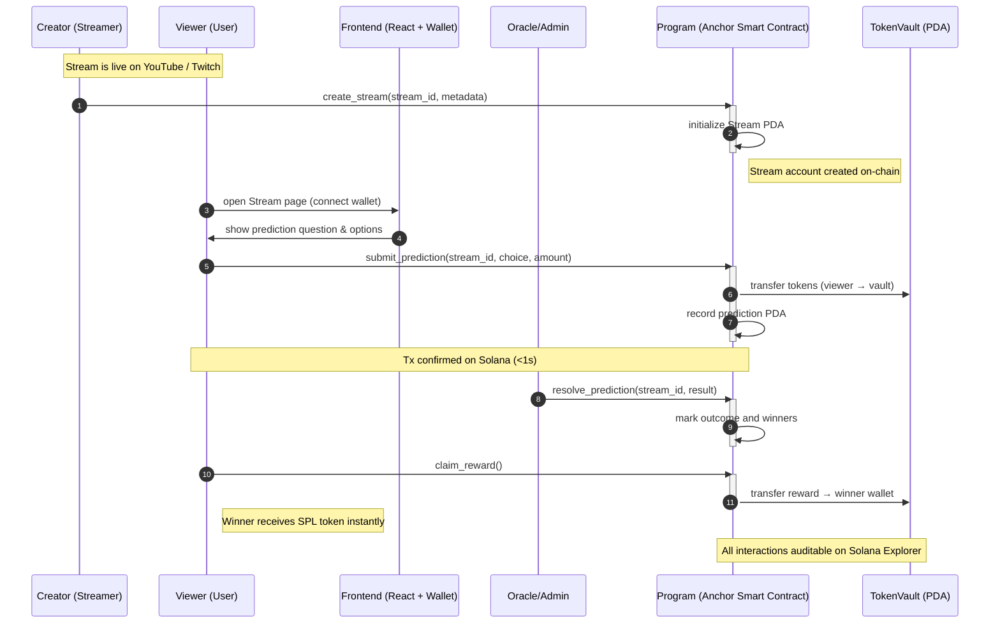

# 🎬 CypherCast — _Watch. Predict. Earn._

> **On-chain Interactive Streaming Layer built on Solana.**  
> Engage audiences with live predictions, token staking, and transparent rewards — powered by Anchor & SPL Tokens.

---

## ⚡ Quick Links

**📌 Hackathon Submission Guides (9 Days Remaining):**

- 📊 **[Progress Dashboard](./PROGRESS_DASHBOARD.md)** - Real-time status tracking with visual indicators ⭐ **START HERE**
- 📋 **[Timeline Assessment & Recommendations](./TIMELINE_ASSESSMENT.md)** - Comprehensive 9-day roadmap with risk analysis
- ⚡ **[Quick Action Guide](./QUICK_ACTION_GUIDE.md)** - Daily priorities, checklists, and emergency decision matrix
- 🗺️ **[Implementation Roadmap](./IMPLEMENTATION_ROADMAP.md)** - Priority matrix, daily schedules, and success metrics
- 🛠️ **[Code Templates](./CODE_TEMPLATES.md)** - Ready-to-use code snippets for smart contracts and frontend
- 🇹🇭 **[ข้อเสนอแนะ (ภาษาไทย)](./RECOMMENDATIONS_TH.md)** - Thai language summary and recommendations

**Current Status:** 🟡 25-30% Complete | **Risk Level:** 🔴 Critical | **Action Required:** Immediate implementation of reward system

---

## 🚀 Overview

**CypherCast** transforms passive viewing into active participation.  
Instead of just watching, viewers can **predict live outcomes**, **stake tokens**, and **earn rewards** on-chain.

- 🧠 **For Viewers:** Make predictions during streams → Win tokens instantly
- 🎥 **For Creators:** Boost engagement and earn from every prediction pool
- 🔐 **Powered by Solana:** Sub-second, low-fee microtransactions secured by PDAs

> “Not another streaming platform — it’s a Web3 layer that enhances existing ones like YouTube or Twitch.”

---

## 🧩 Core Concept

| Problem                                        | Solution                                              | Why Solana (OPOS)                   |
| ---------------------------------------------- | ----------------------------------------------------- | ----------------------------------- |
| 70% of viewers just watch, no participation    | Viewers stake tokens to predict outcomes in real-time | ⚡ Sub-second, low-fee transactions |
| Creators rely on ads and tips that don’t scale | Creator earns from prediction engagement pools        | 🔐 Secure PDAs & on-chain proof     |
| Fans get no ownership or rewards               | Transparent reward distribution via Anchor            | 📱 Solana Mobile Stack-ready UX     |

---

## ⚙️ Architecture Overview

CypherCast consists of **three main layers** — React frontend, Off-chain integration, and On-chain Solana programs.

```mermaid
---
config:
  theme: dark
  themeVariables:
    fontSize: 14px
    edgeLabelBackground: '#111'
  flowchart:
    curve: monotoneX
  layout: elk
---
flowchart TD
    %% HEADER
    D0["CypherCast – Watch. Predict. Earn.\nWeb3 Interactive Streaming Layer on Solana"]:::title

    %% FRONTEND LAYER
    subgraph frontend [Frontend Layer]
        direction TB
        fa([User Entry - App UI])
        A1[Stream Embed\nYouTube / Twitch]
        A2[Prediction Panel & Stake UI]
        A3[WalletConnect\nPhantom / Solflare]:::wallet
        A4[Stake + Claim Buttons]
    end

    %% OFFCHAIN LAYER
    subgraph offchain [Off-chain Services]
        direction TB
        ob1[Surfpool SDK\nTesting]
        ob2[Oracle Script\nMock Resolver]
        ob3[Metadata IPFS]
        ob4[API Gateway / WebSocket]
    end

    %% ONCHAIN LAYER
    subgraph onchain [On-Chain Programs - Solana + Anchor]
        direction TB
        oc1[Program: StreamManager]
        oc2[Program: FanGame\nPrediction Engine]
        oc3[(TokenVault\nStake & Reward)]:::token
    end

    %% NETWORK
    subgraph network [Solana Network]
        direction TB
        sol[💠 Devnet / Mainnet Cluster]:::network
    end

    %% CONNECTIONS
    D0 --> fa
    fa --> A1 --> A2 --> A3 --> A4
    A4 -- User Events --> ob4
    A3 -- Wallet API --> ob4
    ob4 -- WebSocket/API TX --> oc1
    ob1 --> ob2 --> ob3 --> ob4
    oc1 --> oc2 --> oc3
    oc3 --- sol
    sol -. Stake / Resolve / Claim .-> oc3
    oc3 -. Smart Contract Events .-> ob4
    ob4 -. Data & Updates .-> fa

    %% STYLING
    style frontend fill:#1a1a3d,stroke:#9a6bff,stroke-width:2px
    style offchain fill:#00332b,stroke:#00ffc3,stroke-width:2px
    style onchain fill:#3a183b,stroke:#ff66c4,stroke-width:2px
    style network fill:#141414,stroke:#57e6ff,stroke-width:2px
    style D0 fill:#000,stroke:#9a6bff,stroke-width:2px,color:#fff

    classDef wallet fill:#336633,stroke:#fff,stroke-width:1px,color:#fff;
    classDef token fill:#0057b7,stroke:#ff0,stroke-width:2px,color:#fff;
    classDef network fill:#0c2340,stroke:#57e6ff,stroke-width:2px,color:#9fe2ff;
    classDef title fill:#000,stroke:#9a6bff,stroke-width:2px,color:#fff,font-weight:bold;
```



---

## 🔄 Transaction Flow (Sequence Diagram)



---

## 🧠 Project Structure

```css
cyphercast/
├─ Anchor.toml
├─ programs/
│   └─ cyphercast/
│       ├─ Cargo.toml
│       └─ src/lib.rs
├─ app/
│   ├─ client.ts
│   └─ src/
│       ├─ index.tsx
│       ├─ App.tsx
│       ├─ components/
│       │   ├─ StreamList.tsx
│       │   ├─ StreamView.tsx
│       │   ├─ PredictionForm.tsx
│       │   ├─ WalletConnect.tsx
│       │   └─ StakePanel.tsx
│       └─ context/SolanaProvider.tsx
└─ tests/
    └─ cyphercast.ts
```

---

## 🧱 Example: Anchor.toml

```toml
[programs.devnet]
cyphercast = "YourProgramIDHere"

[registry]
url = "https://anchor.projectserum.com"

[provider]
cluster = "devnet"
wallet = "~/.config/solana/id.json"

[scripts]
test = "anchor test"

[workspace]
members = [
  "programs/cyphercast"
]
```

---

## 🧩 Key Anchor Instructions

| Instruction            | Description                                |
| ---------------------- | ------------------------------------------ |
| `create_stream()`      | Initializes a stream PDA linked to creator |
| `join_stream()`        | Records viewer participation               |
| `submit_prediction()`  | Submits user’s predicted outcome & stake   |
| `resolve_prediction()` | Oracle or creator finalizes result         |
| `claim_reward()`       | Winner claims SPL reward from TokenVault   |

---

## 💻 Local Setup

### 1️⃣ Prerequisites

- Node.js 18+ — Download: https://nodejs.org/en/download/  
  Verify: node --version (v18+)

- Rust (rustup) — Install: https://rustup.rs/  
  Verify: rustc --version

- Anchor CLI — Install & docs: https://github.com/coral-xyz/anchor#installation  
  Verify: anchor --version

- Solana CLI — Install: https://docs.solana.com/cli/install-solana-cli-tools  
  Verify: solana --version

- Yarn (optional) — Install: https://yarnpkg.com/getting-started/install  
   or npm (bundled with Node.js) — https://www.npmjs.com/get-npm  
   Verify: yarn --version or npm --version

### 2️⃣ Install & Build

```bash
git clone https://github.com/YOUR_USERNAME/cyphercast.git
cd cyphercast

# install deps

yarn install

# build and deploy to devnet

anchor build
anchor deploy

```

### 3️⃣ Run Frontend

```bash
cd app
yarn dev
```

Open: http://localhost:3000

---

## 🎥 Demo Flow

1. Creator opens app → connects wallet → creates a stream

2. Viewer joins stream → connects wallet → sees prediction question

3. Viewer stakes token (via Phantom)

4. Creator or Oracle resolves outcome on-chain

5. Winners claim rewards instantly

All interactions are verifiable on Solana Explorer.
Transactions confirm in sub-second finality.

---

## 🧭 Roadmap

| Phase                         | Goal                               | Key Deliverables                        |
| ----------------------------- | ---------------------------------- | --------------------------------------- |
| **Phase 1 – MVP (Hackathon)** | Technical proof of concept         | Anchor programs + React UI + Demo video |
| **Phase 2 – Product Proof**   | Reward distribution + mock oracles | TokenVault payouts + UX polish          |
| **Phase 3 – Market Proof**    | Validate with real creators        | Beta site + social traction             |
| **Phase 4 – Ecosystem**       | DAO + Revenue split protocol       | Governance + mobile-native UX           |

---

## 🧱 Technology Stack

| Layer               | Technology                                         |
| ------------------- | -------------------------------------------------- |
| **Frontend**        | React, Vite, Solana Wallet Adapter, TypeScript     |
| **Smart Contracts** | Anchor (Rust), Solana Program Library (SPL Token)  |
| **Off-chain**       | Surfpool SDK (testing), IPFS, Oracle Script (mock) |
| **Network**         | Solana Devnet                                      |
| **Design**          | Dark neon Solana theme (teal / purple / black)     |

---

## 🪙 Token & Security Model

1. SPL Tokens: Used for staking and rewards

2. PDAs: Secure account ownership (no spoofing)

3. On-chain Proofs: All predictions & payouts verifiable

4. Upgradeable Program: For safe iteration post-hackathon

---

## 🧑‍💻 Contributors

| Role            | Member    | Focus                                |
| --------------- | --------- | ------------------------------------ |
| Dev / Technical | Worrapong | Anchor program, frontend integration |
| Biz / Growth    | Worrapong | Market validation, creator outreach  |
| Pitch / Design  | Worrapong | Presentation, deck, and demo video   |

---

## 🌐 Built for

[Solana Cypherpunk Hackathon – October 2025]

"Streaming meets Web3. Viewers don’t just watch — they own the moment."
— CypherCast Team 🚀
