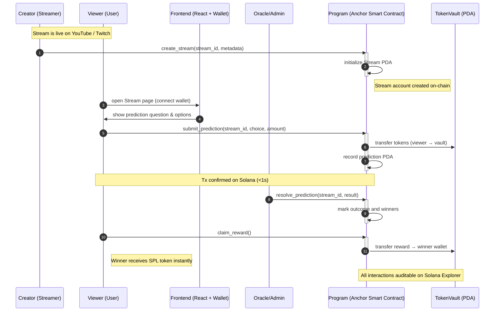
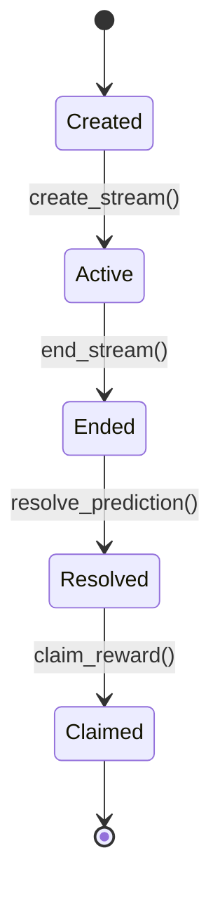
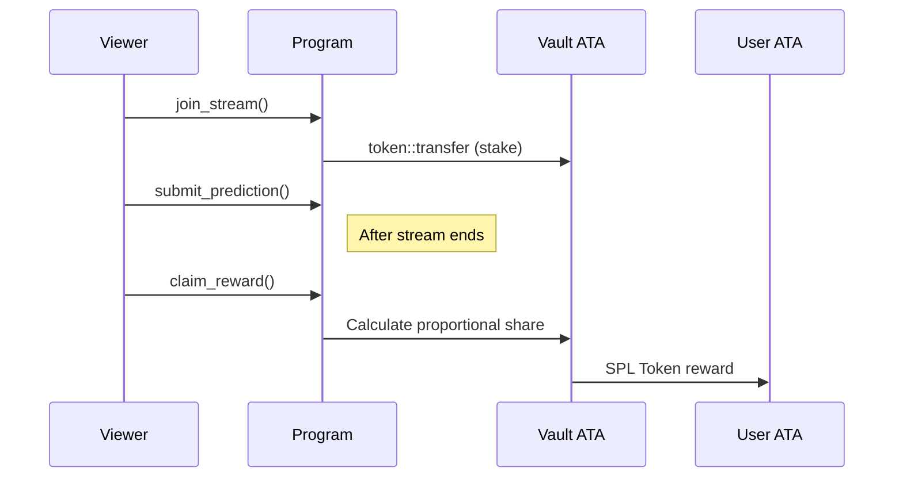
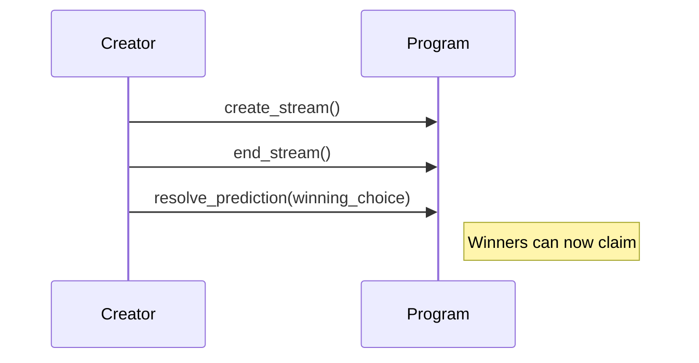
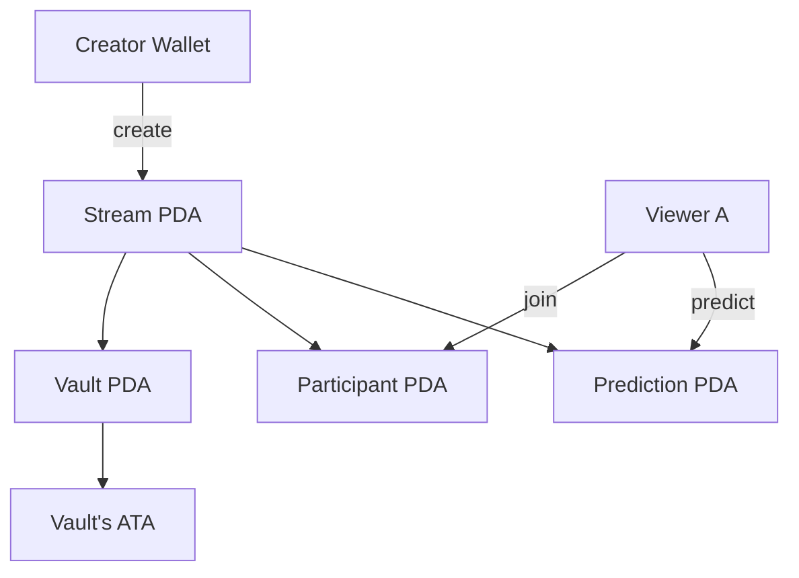

# 🎬 CypherCast — _Watch. Predict. Earn._

> **On-chain Interactive Streaming Layer built on Solana.**  
> Engage audiences with live predictions, token staking, and transparent rewards — powered by Anchor & PDAs.

[](https://solana.com)
[](https://www.anchor-lang.com/)
[-yellow>)](#-current-status-phase-1-mvp-60-complete)

---

## 🧑‍💻 Development Team

| Role            | Member    | Focus                               |
| --------------- | --------- | ----------------------------------- |
| Dev / Technical | Worrapong | Anchor program, PDA architecture    |
| Product         | Worrapong | Vision, roadmap, hackathon strategy |

---

## 📚 Documentation

- [CLI Quick Reference](./docs/CLI-QUICK-REF.md) - Command-line tool usage
- [Local Setup Guide](./LOCAL_SETUP.md) - Development environment setup
- [Anchor Program](./programs/cyphercast/src/lib.rs) - Smart contract source code

---

## 🤝 Contributing

This is a hackathon project currently in Phase 1 MVP. We welcome:

- 🐛 Bug reports and feedback
- 💡 Feature suggestions for Phase 2
- 🔧 Pull requests (especially for reward distribution!)
- 📖 Documentation improvements

### Development Workflow

```bash
# 1. Fork and clone
git clone https://github.com/YOUR_USERNAME/cyphercast.git

# 2. Install dependencies
npm install

# 3. Make changes
# Edit programs/cyphercast/src/lib.rs

# 4. Build and test
anchor build
anchor test

# 5. Submit PR
```

---

## 📄 License

MIT License - see [LICENSE](./LICENSE) file for details

---

## 🌐 Built for Solana Cypherpunk Hackathon

**October 2025** - [Hackathon Details](https://solana.com/hackathon)

> "Streaming meets Web3. Viewers don't just watch — they own the moment."  
> — CypherCast Team 🚀

### 🔗 Links

- **GitHub**: [github.com/chankung9/cyphercast](https://github.com/chankung9/cyphercast)
- **Program ID**: `5a3LkJ73xWyYd7M9jqZtbGY1p9gyJfzSXvHEJdY9ohTF` (Localnet)
- **Status**: Phase 1 MVP - 60% Complete

---

**⭐ Star this repo if you believe in the future of interactive Web3 streaming!**dge/Phase-1%20MVP-yellow)](https://github.com)

---

## � Current Status: Phase 1 MVP (60% Complete)

**✅ What's Working:**

- Anchor program with PDA-based architecture
- 5 core instructions: `create_stream`, `join_stream`, `submit_prediction`, `end_stream`, `claim_reward`
- Participant and prediction tracking on-chain
- CLI demo tool for testing
- Local deployment ready

**🚧 In Development (Phase 2):**

- Token Vault with PDA-based secure storage (see [Phase 2: Token Vault & Reward System](#-phase-2-token-vault--reward-system))
- `resolve_prediction` instruction for outcome determination
- Full reward distribution with SPL token transfers via CPI
- Proportional payout calculation for winners
- React frontend with wallet integration
- Devnet deployment

**Program ID (Localnet):** `5a3LkJ73xWyYd7M9jqZtbGY1p9gyJfzSXvHEJdY9ohTF`

---

## 🚀 Overview

**CypherCast** transforms passive viewing into active participation.  
Instead of just watching, viewers can **predict live outcomes**, **stake tokens**, and **earn rewards** on-chain.

- 🧠 **For Viewers:** Make predictions during streams → Win tokens instantly
- 🎥 **For Creators:** Boost engagement and earn from every prediction pool
- 🔐 **Powered by Solana:** Sub-second, low-fee microtransactions secured by PDAs

> “Not another streaming platform — it’s a Web3 layer that enhances existing ones like YouTube or Twitch.”

---

## 🧩 Core Concept

| Problem                                        | Solution                                              | Why Solana (OPOS)                   |
| ---------------------------------------------- | ----------------------------------------------------- | ----------------------------------- |
| 70% of viewers just watch, no participation    | Viewers stake tokens to predict outcomes in real-time | ⚡ Sub-second, low-fee transactions |
| Creators rely on ads and tips that don’t scale | Creator earns from prediction engagement pools        | 🔐 Secure PDAs & on-chain proof     |
| Fans get no ownership or rewards               | Transparent reward distribution via Anchor            | 📱 Solana Mobile Stack-ready UX     |

---

## ⚙️ Architecture Overview

CypherCast consists of **three main layers** — React frontend, Off-chain integration, and On-chain Solana programs.


---

## 🔄 Transaction Flow (Sequence Diagram)



---

## 🧠 Project Structure

```css
cyphercast/
├─ Anchor.toml
├─ programs/
│   └─ cyphercast/
│       ├─ Cargo.toml
│       └─ src/lib.rs
├─ app/
│   ├─ client.ts
│   └─ src/
│       ├─ index.tsx
│       ├─ App.tsx
│       ├─ components/
│       │   ├─ StreamList.tsx
│       │   ├─ StreamView.tsx
│       │   ├─ PredictionForm.tsx
│       │   ├─ WalletConnect.tsx
│       │   └─ StakePanel.tsx
│       └─ context/SolanaProvider.tsx
└─ tests/
    └─ cyphercast.ts
```

---

## 🧱 Example: Anchor.toml

```toml
[programs.localnet]
cyphercast = "5a3LkJ73xWyYd7M9jqZtbGY1p9gyJfzSXvHEJdY9ohTF"

[registry]
url = "https://anchor.projectserum.com"

[provider]
cluster = "Localnet"
wallet = "~/.config/solana/id.json"

[scripts]
test = "yarn run ts-mocha -p ./tsconfig.json -t 1000000 tests/**/*.ts"

[workspace]
members = [
  "programs/cyphercast"
]
```

> **Note:** Program ID `5a3LkJ73xWyYd7M9jqZtbGY1p9gyJfzSXvHEJdY9ohTF` is for local development.  
> For Devnet/Mainnet deployment, this will be updated.

---

## 🧩 Key Anchor Instructions

| Instruction            | Description                                |
| ---------------------- | ------------------------------------------ |
| `create_stream()`      | Initializes a stream PDA linked to creator |
| `join_stream()`        | Records viewer participation               |
| `submit_prediction()`  | Submits user’s predicted outcome & stake   |
| `resolve_prediction()` | Oracle or creator finalizes result         |
| `claim_reward()`       | Winner claims SPL reward from TokenVault   |

---

## 💻 Local Setup

### 1️⃣ Prerequisites

- Node.js 18+ — Download: https://nodejs.org/en/download/  
  Verify: node --version (v18+)

- Rust (rustup) — Install: https://rustup.rs/  
  Verify: rustc --version

- Anchor CLI — Install & docs: https://github.com/coral-xyz/anchor#installation  
  Verify: anchor --version

- Solana CLI — Install: https://docs.solana.com/cli/install-solana-cli-tools  
  Verify: solana --version

- Yarn (optional) — Install: https://yarnpkg.com/getting-started/install  
   or npm (bundled with Node.js) — https://www.npmjs.com/get-npm  
   Verify: yarn --version or npm --version

### 2️⃣ Install & Build

```bash
git clone https://github.com/chankung9/cyphercast.git
cd cyphercast

# Install dependencies
npm install

# Build the Anchor program
anchor build

# Run tests
anchor test

# Deploy to local validator
anchor deploy
```

### 3️⃣ Run CLI Demo

```bash
# Using the direct CLI tool
node cli/direct-cli.js demo

# Or step by step:
# 1. Create a stream
node cli/direct-cli.js create "My Stream" "Prediction question?"

# 2. Join stream (need stream PDA from step 1)
node cli/direct-cli.js join <STREAM_PDA> 0.1

# 3. Submit prediction
node cli/direct-cli.js predict <STREAM_PDA> 0 0.05

# 4. Fetch stream data
node cli/direct-cli.js fetch <STREAM_PDA>
```

For more CLI commands, see [docs/CLI-QUICK-REF.md](./docs/CLI-QUICK-REF.md)

---

## 🎥 Demo Flow (Phase 1 MVP)

### Current Implementation:

1. **Creator** uses CLI → creates a stream with `create_stream()`

   ```bash
   node cli/direct-cli.js create "Gaming Tournament" "Who will win?"
   ```

2. **Viewer** joins stream with stake → `join_stream()`

   ```bash
   node cli/direct-cli.js join <STREAM_PDA> 0.1
   ```

3. **Viewer** submits prediction → `submit_prediction()`

   ```bash
   node cli/direct-cli.js predict <STREAM_PDA> 0 0.05
   ```

4. **Creator** ends stream → `end_stream()`

   ```bash
   node cli/direct-cli.js end <STREAM_PDA>
   ```

5. **Verification** - View on-chain data
   ```bash
   node cli/direct-cli.js fetch <STREAM_PDA>
   ```

All transactions are recorded on Solana blockchain with **sub-second finality**.

### Coming Soon (Phase 2):

- **Token Vault System**: Secure PDA-based vault with Associated Token Accounts (ATA)
- **Reward Distribution**: Proportional payouts to winners using SPL token CPI transfers
- **Outcome Resolution**: `resolve_prediction` instruction for oracle/creator to finalize results
- **Claim Mechanism**: Individual `claim_reward` calls for gas-efficient distribution
- **React Frontend**: Full wallet integration with Phantom/Solflare
- **Devnet Deployment**: Public testnet deployment for community testing

For detailed architecture, see [Phase 2: Token Vault & Reward System](#-phase-2-token-vault--reward-system)

---

## 🧭 Roadmap

| Phase                       | Goal                         | Key Deliverables                                                                                                                                          | Status           |
| --------------------------- | ---------------------------- | --------------------------------------------------------------------------------------------------------------------------------------------------------- | ---------------- |
| **Phase 1 – MVP (Current)** | Technical proof of concept   | ✅ Anchor program with PDA architecture<br/>✅ CLI testing tool<br/>✅ Core instructions (create, join, predict, end)<br/>⚠️ Basic reward framework       | **60% Complete** |
| **Phase 2 – Reward System** | Complete reward distribution | 🚧 Token Vault with ATA<br/>🚧 resolve_prediction instruction<br/>🚧 SPL token transfers via CPI<br/>🚧 Winner calculation logic<br/>🚧 React frontend UI | **Planned**      |
| **Phase 3 – Market Proof**  | Validate with real creators  | Beta site + social traction                                                                                                                               | **Q1 2026**      |
| **Phase 4 – Ecosystem**     | DAO + Revenue split protocol | Governance + mobile-native UX                                                                                                                             | **Q2 2026**      |

---

## 🧱 Technology Stack

| Layer               | Technology                            | Phase 1 Status |
| ------------------- | ------------------------------------- | -------------- |
| **Smart Contracts** | Anchor 0.31.1 (Rust), Solana PDAs     | ✅ Implemented |
| **Testing**         | TypeScript, Anchor Test Framework     | ✅ Working     |
| **CLI Tools**       | Node.js, @solana/web3.js              | ✅ Working     |
| **Network**         | Solana Localnet (Devnet planned)      | ✅ Localnet    |
| **Frontend**        | React, Vite, Wallet Adapter (Phase 2) | 🚧 Planned     |
| **Off-chain**       | Oracle integration (Phase 2)          | 🚧 Planned     |

**Core Dependencies:**

- `@coral-xyz/anchor` - Solana framework
- `@solana/web3.js` - Solana JavaScript API
- `@solana/spl-token` - Token program (Phase 2)

---

## 🪙 Security & Architecture

### PDA-Based Account Structure

1. **Stream PDAs** - Deterministic addresses derived from:

   ```rust
   seeds = [b"stream", creator.key().as_ref(), stream_id.to_le_bytes()]
   ```

2. **Participant PDAs** - Unique per viewer per stream:

   ```rust
   seeds = [b"participant", stream.key().as_ref(), viewer.key().as_ref()]
   ```

3. **Prediction PDAs** - One prediction per viewer per stream:

   ```rust
   seeds = [b"prediction", stream.key().as_ref(), viewer.key().as_ref()]
   ```

4. **Vault PDAs** - Secure token storage per stream (Phase 2):
   ```rust
   seeds = [b"vault", stream.key().as_ref()]
   ```

### Security Features

- ✅ **No Storage Overhead** - PDAs are derived, not stored
- ✅ **Ownership Verification** - Only program can modify accounts
- ✅ **Deterministic** - Same inputs always generate same addresses
- ✅ **Signer Validation** - Anchor framework checks all permissions
- ✅ **On-chain Audit Trail** - All transactions publicly verifiable

### Phase 2 Security Enhancements

- 🚧 Token vault for stake management with Associated Token Accounts (ATA)
- 🚧 Duplicate claim prevention with `reward_claimed` flag
- 🚧 Multi-signature for critical operations
- 🚧 Time-locks for dispute resolution
- 🚧 Smart contract audit

---

## 🏦 Phase 2: Token Vault & Reward System

### Token Vault Design

The vault is a **secure PDA-based account** that holds staked SPL tokens for each stream. Upon stream resolution, winners can claim their proportional share.

**Vault Account Structure:**

```rust
#[account]
pub struct Vault {
    pub stream: Pubkey,        // Linked stream
    pub token_mint: Pubkey,    // Type of SPL token (e.g., USDC, BONK)
    pub authority: Pubkey,     // PDA authority that signs transfers
    pub bump: u8,              // PDA bump seed
    pub total_staked: u64,     // Total tokens staked in the vault (internal accounting)
}
```

**Access Control:**

- Only the program can transfer from the vault ATA (signed with seeds)
- Tokens are deposited during `join_stream`
- Tokens remain locked until stream ends and winners claim

### Reward Distribution Logic

**Resolution Flow:**

1. Admin or creator calls `resolve_prediction()` setting the correct `winning_choice`
2. Program marks stream as resolved and identifies winning predictions
3. Winners call `claim_reward()` individually to receive their share

**Claim Reward Flow:**

1. User invokes `claim_reward()`
2. Program verifies:
   - Stream is resolved
   - User's prediction matches the winning choice
   - Stake exists and hasn't been claimed already
3. **Payout calculation**: Proportional share of total pool among correct predictors
4. Program uses CPI `token::transfer` to send SPL tokens from vault ATA → user's ATA

**On-Chain Efficiency:**

- Avoids heavy loops by requiring individual claims
- No pre-computation of all winners
- Gas-efficient per-user reward distribution

### Stream State Lifecycle



**Stream Account Fields (Phase 2):**

```rust
pub struct Stream {
    pub creator: Pubkey,
    pub stream_id: u64,
    pub title: String,
    pub start_time: i64,
    pub end_time: i64,
    pub total_stake: u64,
    pub is_active: bool,
    pub bump: u8,
}
```

### Enhanced Instruction Flow

**For Viewers (with Token Vault):**



**For Creator:**



### PDA Structure Diagram



### Program Directory Layout (Modular Architecture)

```text
programs/
└── cyphercast/
    ├── Cargo.toml
    └── src/
        ├── lib.rs              # Entrypoint + #[program] declarations
        ├── instructions/
        │   ├── create_stream.rs
        │   ├── join_stream.rs
        │   ├── submit_prediction.rs
        │   ├── end_stream.rs
        │   ├── resolve_prediction.rs
        │   └── claim_reward.rs
        ├── state/
        │   ├── stream.rs
        │   ├── participant.rs
        │   ├── prediction.rs
        │   └── vault.rs
        └── utils.rs
```

### Security Best Practices

- **PDA seeds** must be consistent across frontend/backend
- **Validate signers** and ownership on every instruction
- **Prevent duplicate claims** with `reward_claimed: bool` flag
- Use **`has_one =`** Anchor constraints to enforce account linkage
- **Overflow protection** for token calculations
- **Time-locks** for dispute resolution windows

### Phase 2 Implementation Roadmap

- [ ] Implement `resolve_prediction` instruction
- [ ] Implement `claim_reward` instruction with token transfers
- [ ] Integrate Vault ATA in `join_stream`
- [ ] Add unit tests for edge cases:
  - Wrong predictions
  - Double claim attempts
  - Vault underflow scenarios
- [ ] Deploy to devnet
- [ ] Connect with React frontend

---

## 🧑‍💻 Contributors

| Role            | Member    | Focus                                |
| --------------- | --------- | ------------------------------------ |
| Dev / Technical | Worrapong | Anchor program, frontend integration |
| Biz / Growth    | Worrapong | Market validation, creator outreach  |
| Pitch / Design  | Worrapong | Presentation, deck, and demo video   |

---

## 🌐 Built for

[Solana Cypherpunk Hackathon – October 2025]

"Streaming meets Web3. Viewers don’t just watch — they own the moment."
— CypherCast Team 🚀
